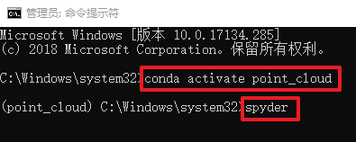

# GMFE-Net 

Point cloud semantic segmentation model with general multi-feature fusion and extraction.

## Installation 

* OS: Windwos 10 or 11  
* RAM: 64GB or above  
* GPU: NVIDIA Quadro RTX6000 or similar  
* IDE: Spyder (in Anaconda)  
* Environment: Python 3.7.16, Keras 2.6.0(with Tensorflow 2.6.0 as the backend), cudatoolkit 11.3.1, cudnn 8.2.1, plyfile 0.7.2, scikit-learn 1.0.2, pandas 1.1.5, Open3D 0.17.0 

## Usage 

Take the SensatUrban dataset as an example. Start by activating the environment and opening Spyder.  

Then open the file "step1_GMFE-Net_pre_data_random_subsample_SensatUrban.py".  

Click "Run" to start the data preprocessing.  

After running the program "step2_GMFE-Net_train_test_visulization_SensatUrban.py", the following options are displayed.  

The final visualization is shown in the figure below.  

Note: The path in the code needs to be modified to where you store the dataset.  

## Acknowledgments 

This project wouldn't have been possible without the support and contributions of several individuals and resources.  
Thanks to (in no particular order):
* https://github.com/charlesq34/pointnet
* https://github.com/charlesq34/pointnet2
* https://github.com/HuguesTHOMAS/KPConv
* https://github.com/hkust-vgd/shellnet
* https://github.com/QingyongHu/RandLA-Net
* https://github.com/leofansq/SCF-Net
* https://keras.io/examples/vision/pointnet/

## Note 

Due to GitHub's limitation on uploading large files, we save the weights files at the following URL: 
